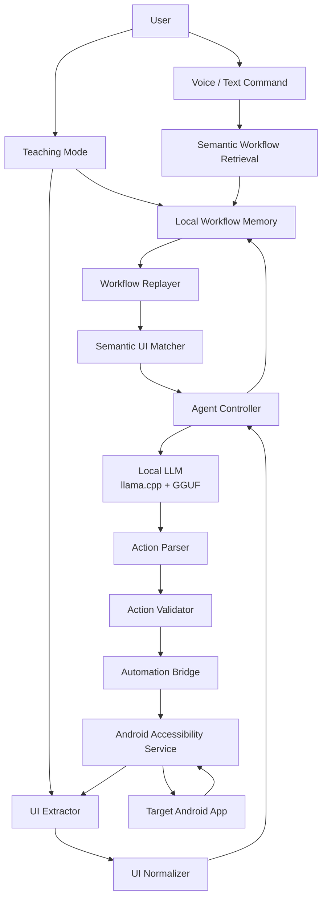
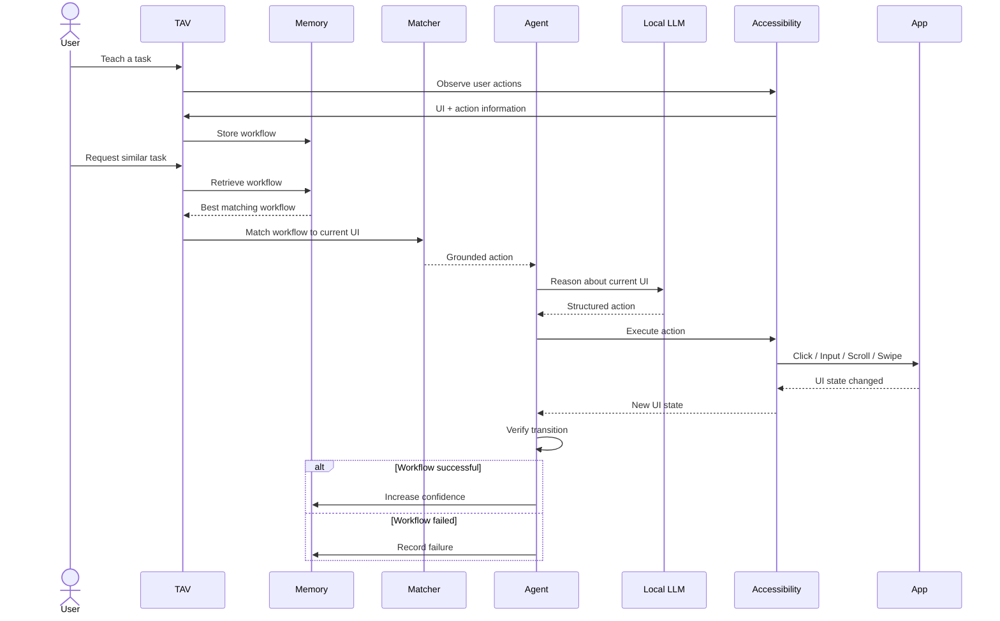

# 🔮 Teachable Voice Automation (TAV)

[](https://kotlinlang.org/)
[](https://developer.android.com/)
[](https://developer.android.com/jetpack/compose)
[](#-on-device-ai)
[](#-android-automation-layer)
[](#-privacy-first-design)

> **Teachable Voice Automation (TAV)** is a privacy-first Android automation system that allows users to **teach a task once and reuse it later**. TAV combines Android Accessibility Services, UI understanding, local workflow memory, semantic matching, workflow replay, and an on-device LLM to automate multi-step tasks across Android applications.

---

## 📑 Project Resources

| Resource | Link |
|---|---|
| 📊 **Project Presentation** | [View / Download Presentation](./MSRIT_Chocochipcookies-submission-2_compressed.pdf) |
| 📄 **AI Disclosure Form** | [View / Download AI Disclosure Form](./Sam_chocochipcookies_LangAI3.0_AI_Disclosure%201.docx) |
| 🎥 **Video Link** | [Watch Project Demo](https://drive.google.com/file/d/1IxvRJ4u7mLaf9M77QkqxQz_EHH29XfEC/view) |

> 🎥 The project demonstration video is included/referenced inside the presentation.

---

## 🧠 Overview

Traditional mobile automation systems require users to manually configure every action.

TAV introduces a **Teach → Remember → Retrieve → Replay → Adapt** approach.

Instead of defining a rigid automation script, the user can demonstrate a task once. TAV observes the interaction, converts the interaction trajectory into a reusable workflow, stores it locally, and later attempts to replay the learned workflow when the user requests the same or a semantically similar task.

### Example

The user teaches:

> "Open the shopping app, search for milk, select the product and add it to the cart."

Later, the user can say:

> "Buy milk."

TAV can retrieve the previously learned workflow, match the stored steps against the current UI, and execute the task.

---

# 🎯 Core Idea

TAV is built around six major stages:

```text
        ┌─────────────┐
        │   TEACH     │
        └──────┬──────┘
               ↓
        ┌─────────────┐
        │   REMEMBER  │
        └──────┬──────┘
               ↓
        ┌─────────────┐
        │   RETRIEVE  │
        └──────┬──────┘
               ↓
        ┌─────────────┐
        │    GROUND   │
        └──────┬──────┘
               ↓
        ┌─────────────┐
        │     ACT     │
        └──────┬──────┘
               ↓
        ┌─────────────┐
        │   VERIFY    │
        └─────────────┘
```

### 1. Teach

The user demonstrates a task manually.

TAV observes actions such as:

- Click
- Long click
- Text input
- Scroll
- Swipe
- Back navigation
- UI transitions

### 2. Remember

The successful interaction is converted into a structured workflow containing:

- Application
- Goal
- Ordered actions
- UI element information
- Input parameters
- Semantic descriptions
- Workflow version
- Confidence
- Success/failure statistics

### 3. Retrieve

When a new request arrives, TAV searches its local workflow memory for a previously learned task.

### 4. Ground

Stored workflow steps are matched against the **current UI hierarchy** instead of blindly replaying coordinates.

### 5. Act

TAV executes the matched actions through Android Accessibility APIs.

### 6. Verify

The system observes the resulting UI state and determines whether the action succeeded, failed, or requires recovery.

---

# 🏗️ System Architecture



---

# 🔄 End-to-End Workflow



---

# ✨ Key Features

## 1. 🎓 Teach Mode

TAV allows the user to demonstrate a workflow manually.

The teaching system observes:

- UI elements
- User actions
- Element identifiers
- Text values
- Input values
- Scroll direction
- Navigation
- Application state

The interaction trajectory can then be transformed into a reusable workflow.

### Main components

```text
TeachSession
UserActionObserver
WorkflowGeneralizer
SemanticStep
SemanticMatcher
```

---

## 2. 🧠 Local Workflow Memory

TAV maintains persistent workflow memory on the device.

The memory stores information such as:

```text
Workflow
├── ID
├── Application
├── Goal
├── Steps
├── Parameters
├── Version
├── Confidence
├── Success Count
├── Failure Count
├── Created Time
└── Last Used Time
```

Workflow data is persisted locally rather than relying on a remote workflow database.

---

## 3. 🔎 Semantic Workflow Retrieval

A new user request does not need to exactly match the original teaching command.

For example:

```text
Original:
"Find milk and add it to cart"

New request:
"Buy milk"

New request:
"Add milk to my cart"
```

The system can attempt to identify the previously learned workflow based on semantic similarity and workflow reliability.

---

# 4. 🎯 Semantic UI Matching

TAV does not rely only on fixed screen coordinates.

The system extracts the current accessibility hierarchy and attempts to identify the correct UI element based on information such as:

- Text
- Content description
- Resource ID
- Class/type
- Clickability
- Editability
- Scrollability
- UI hierarchy
- Semantic context

This allows workflows to survive certain UI changes.

```text
Stored Workflow Step
        │
        ↓
Current UI Hierarchy
        │
        ↓
Semantic Matcher
        │
        ↓
Best Matching UI Element
        │
        ↓
Accessibility Action
```

---

# 5. 🔁 Workflow Replay

Previously learned workflows can be replayed against the current application state.

The replay engine attempts deterministic matching first.

```text
Workflow Step
     ↓
Find matching UI element
     ↓
Match found?
   /       \
 YES       NO
  ↓         ↓
Execute    Agent Reasoning
  ↓         ↓
Observe    Find alternative
  ↓         ↓
Verify     Continue
```

This reduces unnecessary reasoning when a workflow can be executed deterministically.

---

# 6. 🤖 On-Device AI

TAV includes an on-device LLM architecture using:

- **llama.cpp**
- **GGUF models**
- **C++ / JNI**
- **Kotlin coroutine-based inference**

The local model can reason over structured UI information and generate actions.

### Local AI pipeline

```text
UI State
   ↓
Prompt Construction
   ↓
Local GGUF Model
   ↓
JSON Action
   ↓
ActionParser
   ↓
ActionValidator
   ↓
AutomationBridge
```

Example:

```json
{
  "action": "CLICK",
  "element_id": "node_14"
}
```

Supported actions include:

```text
OPEN_APP
CLICK
LONG_CLICK
INPUT
SCROLL
SWIPE
BACK
HOME
RECENTS
NOTIFICATIONS
WAIT
DONE
ASK
```

---

# 🔐 Privacy-First Design

TAV is designed around local processing.

The offline architecture is based on:

```text
Microphone / User Input
        ↓
Local Processing
        ↓
Local Workflow Memory
        ↓
Local UI Extraction
        ↓
Local Model
        ↓
Android Accessibility
        ↓
Target Application
```

### Privacy principles

- No API key is required for the documented local AI architecture.
- No cloud workflow database is required.
- Workflow memory is stored locally.
- UI extraction happens through Android Accessibility APIs.
- Local GGUF models can be executed through `llama.cpp`.
- The project does not require exposing workflow data to an external server.

> **Important:** API credentials and secrets should never be committed to the repository. Local configuration files such as `local.properties` are excluded through `.gitignore`.

---

# 📱 Android Automation Layer

TAV uses Android Accessibility Services as the primary automation bridge.

### `MirrorAccessibilityService`

The accessibility service provides:

- UI hierarchy access
- UI element discovery
- Click execution
- Text input
- Scroll operations
- Gesture dispatch
- Window observation
- Screenshot capture where supported
- Accessibility overlays

---

# 🪞 UI Mirroring

TAV contains a remote UI mirroring layer that allows the target application's interface to be represented inside the TAV interface.

There are two main approaches:

### Screenshot View

The application can capture the target display and provide an interactive representation.

It supports:

- Screen rendering
- Touch coordinate translation
- Click interaction
- Long press
- Swipe gestures
- Interactive element overlays

### Component Tree View

The accessibility hierarchy is converted into normalized UI components.

Example:

```text
Screen
├── Toolbar
│   ├── Back Button
│   └── Search
│
├── Content
│   ├── Product Card
│   │   ├── Product Name
│   │   ├── Price
│   │   └── Add Button
│   │
│   └── Product Card
│
└── Navigation
```

---

# 🧩 UI Extraction Pipeline

```mermaid
flowchart LR

    App[Target Application]
        ↓
    AccessibilityEvent
        ↓
    AccessibilityService
        ↓
    UIExtractor
        ↓
    AccessibilityNodeRegistry
        ↓
    UINormalizer
        ↓
    Normalized UI Tree
        ↓
    Agent / Workflow Matcher
```

The UI normalizer converts vendor-specific Android views into common semantic types such as:

```text
Button
TextField
Checkbox
Toggle
Dropdown
Image
List
Card
ScrollableContainer
Text
```

---

# 🧠 Agent Controller

The `AgentController` manages autonomous execution.

The execution loop follows:

```text
OBSERVE
   ↓
UNDERSTAND
   ↓
PLAN
   ↓
VALIDATE
   ↓
ACT
   ↓
OBSERVE AGAIN
```

### Execution steps

1. Receive the user's goal.
2. Resolve the target application.
3. Launch the target application.
4. Observe the current UI.
5. Extract interactive elements.
6. Generate the next action.
7. Validate the action.
8. Execute through Accessibility APIs.
9. Wait for the UI to settle.
10. Compare the new state.
11. Detect loops or failures.
12. Continue until completion.

---

# 🛡️ Action Validation

Before executing an action, TAV validates the requested UI target.

This helps prevent incorrect interactions caused by:

- Stale UI elements
- Changed screens
- Invalid element IDs
- Missing elements
- Incorrect action types

```text
Model Output
     ↓
ActionParser
     ↓
ActionValidator
     ↓
Valid?
 ┌───┴────┐
 YES      NO
  ↓        ↓
Execute   Retry / Recover
```

---

# ♻️ Loop Detection & Recovery

Autonomous UI agents can sometimes become stuck.

TAV therefore maintains transition history and detects repeated states or ineffective actions.

Example:

```text
State A
  ↓
State B
  ↓
State A
  ↓
State B
```

The `LoopDetector` can identify this type of oscillation.

The `RecoveryManager` can then attempt recovery actions such as:

```text
BACK
↓
Observe
↓
Retry
```

If recovery repeatedly fails, the task is terminated safely.

---

# 🎙️ Voice Interaction

TAV provides an Android voice interaction architecture with:

- Microphone capture
- Voice interaction session
- Wake-word handling
- Voice state management
- Voice listening overlay
- Command routing

The wake phrase is treated as a local control signal before task execution.

Example:

```text
"Hey, start listening"
        ↓
Wake Word Detection
        ↓
Capture Command
        ↓
Interpret Request
        ↓
Retrieve / Execute Workflow
```

---

# 🧭 Request Routing

Natural-language requests are converted into structured task information.

Example:

```json
{
  "intent": "AUTOMATE",
  "target_app": "Shopping App",
  "task": "Find milk",
  "parameters": {
    "item": "milk"
  }
}
```

The application resolver helps map user-facing application names to installed Android packages.

---

# 🗂️ Project Structure

```text
TAV-main/
│
├── app/
│   └── src/
│       └── main/
│           ├── cpp/
│           │   ├── llama.cpp/
│           │   ├── CMakeLists.txt
│           │   └── tav_llama_jni.cpp
│           │
│           ├── java/
│           │   └── com/example/teachablevoice/
│           │       │
│           │       ├── agent/
│           │       │   ├── AgentController.kt
│           │       │   ├── AgentAction.kt
│           │       │   ├── ActionParser.kt
│           │       │   ├── ActionValidator.kt
│           │       │   ├── LoopDetector.kt
│           │       │   └── RecoveryManager.kt
│           │       │
│           │       ├── bridge/
│           │       │   ├── AutomationBridge.kt
│           │       │   ├── AutomationBridgeImpl.kt
│           │       │   ├── MirrorAccessibilityService.kt
│           │       │   ├── MirrorRenderer.kt
│           │       │   ├── UIExtractor.kt
│           │       │   └── UINormalizer.kt
│           │       │
│           │       ├── memory/
│           │       │   ├── WorkflowMemory.kt
│           │       │   └── WorkflowMemoryManager.kt
│           │       │
│           │       ├── model/
│           │       │   ├── LlamaCppBackend.kt
│           │       │   ├── ModelBackend.kt
│           │       │   └── ModelManager.kt
│           │       │
│           │       ├── replay/
│           │       │   └── WorkflowReplayer.kt
│           │       │
│           │       ├── router/
│           │       │   └── AgentRequestRouter.kt
│           │       │
│           │       ├── teach/
│           │       │   ├── TeachSession.kt
│           │       │   ├── SemanticMatcher.kt
│           │       │   ├── SemanticStep.kt
│           │       │   └── WorkflowGeneralizer.kt
│           │       │
│           │       ├── ui/
│           │       │   ├── AppLauncherScreen.kt
│           │       │   └── ModelChatScreen.kt
│           │       │
│           │       └── voice/
│           │           ├── AudioCaptureManager.kt
│           │           ├── VoiceInputManager.kt
│           │           ├── WakeWordManager.kt
│           │           └── VoiceListeningOverlayManager.kt
│           │
│           └── res/
│
├── Final_App_Details.md
├── agent_payload.json
├── router_payload.json
├── teach_router_payload.json
├── MSRIT_Chocochipcookies-submission-2_compressed.pdf
├── Sam_chocochipcookies_LangAI3.0_AI_Disclosure 1.docx
├── README.md
└── ...
```

---

# 🛠️ Tech Stack

## Android

| Technology | Purpose |
|---|---|
| **Kotlin 2.2.10** | Primary development language |
| **Android SDK 37** | Application platform |
| **Jetpack Compose** | Declarative UI |
| **Material 3** | UI components |
| **Android Accessibility API** | UI extraction and automation |
| **Foreground Services** | Long-running automation |
| **C++ / JNI** | Native local inference bridge |
| **CMake** | Native build system |
| **NDK 25.1.8937393** | Native Android development |

## AI & Automation

| Technology | Purpose |
|---|---|
| **llama.cpp** | Local LLM inference |
| **GGUF** | Quantized local model format |
| **Semantic Matcher** | UI/workflow matching |
| **Workflow Memory** | Persistent learned workflows |
| **Workflow Replayer** | Deterministic workflow execution |
| **Action Validator** | Safe action validation |
| **Loop Detector** | Execution loop detection |
| **Recovery Manager** | Agent recovery |

---

# 🔒 Permissions

TAV uses Android permissions required for its automation and voice functionality.

Important permissions include:

```xml
android.permission.RECORD_AUDIO
android.permission.FOREGROUND_SERVICE
android.permission.FOREGROUND_SERVICE_MICROPHONE
android.permission.FOREGROUND_SERVICE_SPECIAL_USE
android.permission.QUERY_ALL_PACKAGES
```

The Accessibility Service additionally requires:

```text
BIND_ACCESSIBILITY_SERVICE
```

The user must manually enable the TAV Accessibility Service from Android Settings.

---

# 🚀 Setup & Build

## Prerequisites

Install:

- Android Studio
- Android SDK 37
- Android NDK 25.1.8937393
- CMake 3.22.1
- Android device/emulator

For the local AI path, a compatible **GGUF model** is required.

---

## 1. Clone the Repository

```bash
git clone <your-repository-url>
cd TAV-main
```

---

## 2. Configure Local AI

The local inference backend uses:

```text
llama.cpp
      ↓
JNI
      ↓
LlamaCppBackend
      ↓
GGUF model
      ↓
Local inference
```

Place the compatible GGUF model in the application's assets directory according to the local LLM configuration.

No API key should be placed inside the repository.

---

## 3. Build the Application

### Windows

```bash
gradlew.bat assembleDebug
```

### Linux / macOS

```bash
./gradlew assembleDebug
```

Install on a connected Android device:

```bash
./gradlew installDebug
```

---

# ⚙️ Device Configuration

After installation:

### 1. Enable Accessibility

Go to:

```text
Settings
→ Accessibility
→ Installed / Downloaded Apps
→ Teachable Voice Automation
→ Enable
```

Grant the requested accessibility control.

### 2. Grant Microphone Permission

Enable microphone access when voice interaction is used.

### 3. Enable the Assistant

If using Android's voice-assistant integration:

```text
Settings
→ Apps
→ Default Apps
→ Digital Assistant App
```

Select TAV where supported by the device.

---

# 🧪 Testing

The project contains both unit and instrumentation testing infrastructure.

Examples include:

```text
app/src/test/
app/src/androidTest/
```

The repository includes testing around areas such as:

- Application resolution
- Workflow execution
- Agent workflows
- Android instrumentation

Run unit tests:

```bash
./gradlew test
```

Run instrumentation tests:

```bash
./gradlew connectedAndroidTest
```

---

# ⚠️ Known Limitations

### Android Version

Some screenshot and accessibility functionality depends on Android API level.

### Accessibility Restrictions

Different applications expose different levels of accessibility information.

Some applications may:

- Hide UI elements
- Use custom rendering
- Restrict accessibility interaction
- Change their UI dynamically

### Local Model Performance

On-device LLM inference depends on:

- Device CPU
- Available RAM
- Model size
- Quantization
- Prompt length

Smaller GGUF models are generally more suitable for mobile execution.

### UI Changes

A learned workflow may require adaptation if the target application's UI changes significantly.

TAV therefore combines deterministic matching with agent-based reasoning and recovery.

---

# 🔐 Security & Repository Hygiene

Never commit:

```text
API keys
Passwords
Tokens
local.properties
.env files
Secrets
Large private model files
```

The repository `.gitignore` excludes local configuration and sensitive credentials.

For example:

```text
local.properties
.env
*.env
secrets.properties
```

Local GGUF/model binaries are also excluded from version control.

---

# 📈 Future Improvements

Potential improvements include:

- More advanced local semantic embeddings
- Better offline speech recognition
- Improved workflow generalization
- Stronger UI-change adaptation
- Workflow version management
- More robust confidence scoring
- Better local vector retrieval
- More efficient mobile LLM inference
- Expanded Android application compatibility
- Improved failure recovery
- Privacy-focused workflow management UI

---

# 👥 Project

**Teachable Voice Automation (TAV)**

An Android-based intelligent automation system focused on:

> **Teach Once → Remember Locally → Retrieve → Ground → Act → Verify**

The goal is to move mobile automation away from rigid scripts toward **learnable, reusable and adaptive workflows** while keeping the architecture privacy-focused and suitable for local execution.

---

# 📄 License

This project is provided under the terms defined by the repository source code.

See the project source files for applicable licensing information.
